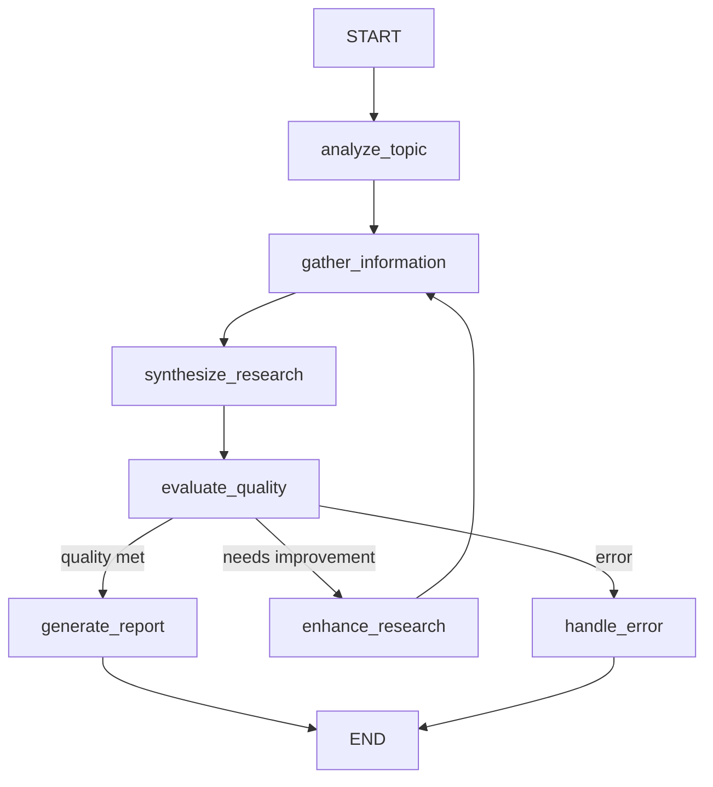

# 🚀 Intelligent Research Mentor

A comprehensive research automation system built with **LangChain**, **LangGraph**, and **LangSmith** that demonstrates production-ready patterns for LLM-powered applications.

[](https://www.python.org/downloads/)
[](LICENSE)
[](https://github.com/psf/black)

## 📑 Table of Contents

- [Overview](#overview)
- [Features](#features)
- [Architecture](#architecture)
- [Prerequisites](#prerequisites)
- [Quick Start](#quick-start)
- [Installation](#installation)
- [Configuration](#configuration)
- [Usage](#usage)
  - [CLI Mode](#cli-mode)
  - [API Server](#api-server)
  - [Docker Deployment](#docker-deployment)
- [API Reference](#api-reference)
- [Project Structure](#project-structure)
- [LangSmith Integration](#langsmith-integration)
- [Development](#development)
- [Testing](#testing)
- [Deployment](#deployment)
- [Contributing](#contributing)
- [Troubleshooting](#troubleshooting)
- [FAQ](#faq)
- [License](#license)

## 🌟 Overview

The Intelligent Research Mentor is a full-stack application that automates the research process using Large Language Models. It combines:

- **LangChain** for building composable LLM chains and RAG pipelines
- **LangGraph** for creating stateful, multi-step agent workflows
- **LangSmith** for monitoring, tracing, and evaluating LLM applications

The system can analyze any topic, gather information from multiple sources, synthesize findings, evaluate quality, and generate comprehensive research reports.

### What Problem Does It Solve?

Traditional research is time-consuming and often involves:
- Manually searching across multiple sources
- Synthesizing information from disparate documents
- Ensuring comprehensive coverage of a topic
- Maintaining consistent quality standards

This assistant automates these tasks while providing transparency through LangSmith tracing.

## ✨ Features

### Core Capabilities

| Feature                 | Description                                             |
|-------------------------|---------------------------------------------------------|
| **Automated Research**  | Multi-step workflow from topic analysis to final report |
| **RAG Pipeline**        | Document ingestion, chunking, vector storage, and QA    |
| **Quality Scoring**     | Automated evaluation with iterative improvement         |
| **Multi-Format Export** | Markdown, HTML, JSON, and plain text outputs            |
| **Document Management** | Upload PDFs, text files, web pages for RAG              |
| **Batch Processing**    | Research multiple topics simultaneously                 |

### Technical Features

| Feature                | Technology                                           |
|------------------------|------------------------------------------------------|
| **Stateful Workflows** | LangGraph with checkpoint persistence                |
| **LLM Abstraction**    | Factory pattern supporting OpenAI, Ollama, Anthropic |
| **Vector Storage**     | ChromaDB with pluggable architecture                 |
| **Caching**            | In-memory and Redis backends                         |
| **API Server**         | FastAPI with auto-generated OpenAPI docs             |
| **Monitoring**         | Full LangSmith tracing and evaluation                |
| **Structured Logging** | Loguru with JSON and text formats                    |
| **Containerization**   | Docker and docker-compose support                    |

## 🏗️ Architecture

### High-Level Architecture

```
┌─────────────────────────────────────────────────────────────────┐
│                        Client Applications                      │
│                   (Web UI, CLI, API Consumers)                  │
└─────────────────────────────────────────────────────────────────┘
                                  │
                                  ▼
┌─────────────────────────────────────────────────────────────────┐
│                         API Layer (FastAPI)                     │
│  ┌──────────────┐  ┌──────────────┐  ┌──────────────────────┐   │
│  │ Research     │  │ Document     │  │ Health/              │   │
│  │ Router       │  │ Router       │  │ Monitoring           │   │
│  └──────────────┘  └──────────────┘  └──────────────────────┘   │
├─────────────────────────────────────────────────────────────────┤
│                        Service Layer                            │
│  ┌──────────────┐  ┌──────────────┐  ┌──────────────────────┐   │
│  │ Research     │  │ Document     │  │ Cache/               │   │
│  │ Service      │  │ Service      │  │ Export Services      │   │
│  └──────────────┘  └──────────────┘  └──────────────────────┘   │
├─────────────────────────────────────────────────────────────────┤
│                     Workflow Layer (LangGraph)                  │
│                                                                 │
│  ┌───────────────────────────────────────────────────────────┐  │
│  │                                                           │  │
│  │  [Analyze] ──▶ [Gather] ──▶ [Synthesize] ──▶ [Evaluate]   │  │
│  │      ▲                                        │           │  │
│  │      │              ┌─────────────────────┐   │           │  │
│  │      └──────────────┤    [Enhance]        │◀──┘           │  │
│  │                     └─────────────────────┘               │  │
│  │                                        │                  │  │
│  │                                        ▼                  │  │
│  │                                  [Generate Report]        │  │
│  └───────────────────────────────────────────────────────────┘  │
├─────────────────────────────────────────────────────────────────┤
│                      Chain Layer (LangChain)                    │
│  ┌──────────────┐  ┌──────────────┐  ┌──────────────────────┐   │
│  │ Research     │  │ RAG          │  │ Evaluation           │   │
│  │ Chain        │  │ Chain        │  │ Chain                │   │ 
│  └──────────────┘  └──────────────┘  └──────────────────────┘   │
├─────────────────────────────────────────────────────────────────┤
│                    Component Layer                              │
│  ┌──────────────┐  ┌──────────────┐  ┌──────────────────────┐   │
│  │ LLM          │  │ Embeddings   │  │ Vector Store         │   │
│  │ Factory      │  │ Factory      │  │ Manager              │   │
│  └──────────────┘  └──────────────┘  └──────────────────────┘   │
└─────────────────────────────────────────────────────────────────┘
                                  │
                                  ▼
┌─────────────────────────────────────────────────────────────────┐
│                    Monitoring (LangSmith)                       │
│         Tracing │ Evaluation │ Feedback │ Datasets              │
└─────────────────────────────────────────────────────────────────┘
```

### Workflow State Machine



## 📋 Prerequisites

### Required
- **Python 3.9** or higher
- **OpenAI API Key** (or alternative LLM provider)
- **LangSmith API Key** (optional, for monitoring)

### Optional
- **Redis** (for distributed caching)
- **Docker** (for containerized deployment)
- **Ollama** (for local LLM usage)

## 🚀 Quick Start

### One-Command Setup

```bash
# Clone and setup
git clone https://github.com/phamdps/research-mentor.git
cd research-mentor

# Run setup script
chmod +x scripts/setup.sh
./scripts/setup.sh
```

### Manual Setup

```bash
# 1. Clone the repository
git clone https://github.com/phamdps/research-mentor.git
cd research-mentor

# 2. Create virtual environment
python -m venv venv
source venv/bin/activate  # Linux/Mac
# venv\Scripts\activate   # Windows

# 3. Install dependencies
pip install -r requirements.txt

# 4. Configure environment
cp .env.example .env
# Edit .env with your API keys

# 5. Run the application
python run.py
```

### Verify Installation

```bash
# Check health endpoint
curl http://localhost:8000/api/v1/health

# Expected response:
# {"status":"healthy","timestamp":"2024-01-01T00:00:00","version":"1.0.0"}
```

## 📦 Installation

### Development Installation

```bash
# Install with development dependencies
pip install -r requirements.txt
pip install -r requirements-dev.txt

# Setup pre-commit hooks
pre-commit install

# Run tests to verify
pytest tests/ -v
```

### Using Different LLM Providers

```bash
# For local LLM with Ollama
ollama pull llama2
# Update .env: LLM_PROVIDER=ollama LLM_MODEL_NAME=llama2

# For HuggingFace models
pip install transformers torch
# Update .env: LLM_PROVIDER=huggingface LLM_MODEL_NAME=mistralai/Mistral-7B
```

## ⚙️ Configuration

### Environment Variables

Create a `.env` file from `.env.example`:

```bash
# Required
OPENAI_API_KEY=sk-...           # Your OpenAI API key
LANGCHAIN_API_KEY=ls_...        # Your LangSmith API key

# LLM Settings
LLM_PROVIDER=openai             # openai, ollama, anthropic, huggingface
LLM_MODEL_NAME=gpt-3.5-turbo   # Model to use
LLM_TEMPERATURE=0.7            # Creativity (0.0-2.0)
LLM_MAX_TOKENS=2000            # Maximum response length

# Application
ENVIRONMENT=development         # development, staging, production
DEBUG=true                     # Enable debug mode
LOG_LEVEL=INFO                 # DEBUG, INFO, WARNING, ERROR

# Vector Store
VECTOR_STORE_TYPE=chroma       # chroma, faiss, pinecone
VECTOR_STORE_PATH=./data/vector_store
CHUNK_SIZE=1000               # Document chunk size
CHUNK_OVERLAP=200             # Chunk overlap amount

# Workflow
MAX_RESEARCH_ITERATIONS=5     # Maximum refinement loops
RESEARCH_QUALITY_THRESHOLD=0.7 # Minimum quality score (0-1)

# API
API_HOST=0.0.0.0
API_PORT=8000
API_WORKERS=4

# Cache
CACHE_ENABLED=true
REDIS_URL=redis://localhost:6379  # Optional
```

### Configuration Validation

The application validates configuration on startup:

```python
from config.settings import settings

# Configuration is automatically validated
print(settings.LLM_PROVIDER)      # "openai"
print(settings.get_llm_config())  # {"provider": "openai", "model_name": "gpt-3.5-turbo", ...}
```

## 📖 Usage

### CLI Mode

Run research from the command line:

```bash
# Interactive mode
python src/main.py

# With topic argument
python src/main.py "The impact of quantum computing on cybersecurity"

# With options
python src/main.py \
  --topic "AI in Healthcare" \
  --keywords "AI,healthcare,diagnosis" \
  --max-sources 15 \
  --export-format markdown
```

**Example CLI Output:**
```
==============================================================
Researching: Impact of AI on Healthcare
==============================================================

✅ Topic analysis completed
📚 Gathered 5 information sources
🔄 Research findings synthesized
📊 Quality Score: 85/100

==============================================================
Research Report
==============================================================

# Research Report: Impact of AI on Healthcare
...
```

### API Server

Start the API server:

```bash
# Development mode with auto-reload
python run.py

# Production mode
uvicorn api.app:app --host 0.0.0.0 --port 8000 --workers 4
```

**Interactive API Documentation:**
- Swagger UI: http://localhost:8000/api/docs
- ReDoc: http://localhost:8000/api/redoc

### API Usage Examples

#### 1. Start Research

```bash
curl -X POST http://localhost:8000/api/v1/research/analyze \
  -H "Content-Type: application/json" \
  -d '{
    "topic": "Future of Renewable Energy",
    "description": "Analyze trends and predictions for renewable energy",
    "keywords": ["renewable", "energy", "solar", "wind"],
    "max_sources": 10
  }'
```

**Response:**
```json
{
  "task_id": "550e8400-e29b-41d4-a716-446655440000",
  "status": "started",
  "topic": "Future of Renewable Energy",
  "message": "Research task started successfully"
}
```

#### 2. Check Research Status

```bash
curl http://localhost:8000/api/v1/research/550e8400-e29b-41d4-a716-446655440000/status
```

**Response:**
```json
{
  "task_id": "550e8400-e29b-41d4-a716-446655440000",
  "status": "completed",
  "topic": "Future of Renewable Energy",
  "quality_score": 87.5,
  "created_at": "2024-01-15T10:30:00",
  "completed_at": "2024-01-15T10:35:00"
}
```

#### 3. Get Research Report

```bash
curl "http://localhost:8000/api/v1/research/550e8400-e29b-41d4-a716-446655440000/report?format=markdown"
```

#### 4. Upload Document for RAG

```bash
curl -X POST http://localhost:8000/api/v1/documents/upload \
  -F "file=@research_paper.pdf" \
  -F "collection_name=energy_research"
```

#### 5. Search Documents

```bash
curl -X POST http://localhost:8000/api/v1/documents/search \
  -H "Content-Type: application/json" \
  -d '{
    "query": "What are the latest solar panel efficiency improvements?",
    "collection_name": "energy_research",
    "top_k": 5
  }'
```

### Docker Deployment

```bash
# Build and start all services
docker-compose up -d

# View logs
docker-compose logs -f api

# Scale workers
docker-compose up -d --scale worker=3

# Stop services
docker-compose down

# Rebuild after changes
docker-compose up -d --build
```

## 📚 Project Structure

```
research-mentor/
│
├── config/                         # Configuration management
│   ├── settings.py                 # Pydantic settings with validation
│   ├── logging_config.py           # Loguru configuration
│   └── validators.py               # Config validators
│
├── src/                            # Source code
│   ├── core/                       # Domain models & exceptions
│   │   ├── models.py               # ResearchQuery, ResearchResult, etc.
│   │   ├── exceptions.py           # Custom exception hierarchy
│   │   └── constants.py            # Enums and constants
│   │
│   ├── components/                 # Reusable building blocks
│   │   ├── llm_factory.py          # LLM instance factory
│   │   ├── embeddings_factory.py   # Embeddings factory
│   │   ├── vector_store.py         # Vector store manager
│   │   ├── document_loader.py      # Document processing
│   │   └── prompt_templates.py     # Centralized prompts
│   │
│   ├── chains/                     # LangChain chain implementations
│   │   ├── research_chain.py       # Research analysis chain
│   │   ├── rag_chain.py            # RAG QA chain
│   │   └── evaluation_chain.py     # Quality evaluation chain
│   │
│   ├── workflows/                  # LangGraph workflows
│   │   ├── research_workflow.py    # Main workflow orchestrator
│   │   ├── state_manager.py        # State definitions
│   │   ├── nodes.py                # Workflow node implementations
│   │   └── edges.py                # Routing logic
│   │
│   ├── monitoring/                 # Observability
│   │   ├── langsmith_client.py     # LangSmith integration
│   │   ├── tracer.py               # Execution tracing
│   │   ├── evaluator.py            # Quality evaluation
│   │   └── metrics.py              # Metrics collection
│   │
│   ├── services/                   # Business logic
│   │   ├── research_service.py     # Research orchestration
│   │   ├── document_service.py     # Document management
│   │   ├── cache_service.py        # Caching layer
│   │   └── export_service.py       # Report export
│   │
│   ├── utils/                      # Utilities
│   │   ├── decorators.py           # Timing, retry, logging
│   │   ├── helpers.py              # Helper functions
│   │   └── validators.py           # Input validation
│   │
│   └── main.py                     # CLI entry point
│
├── api/                            # FastAPI application
│   ├── app.py                      # App factory & configuration
│   ├── dependencies.py             # Dependency injection
│   ├── middleware.py                # Custom middleware
│   ├── routers/
│   │   ├── research.py             # Research endpoints
│   │   ├── documents.py            # Document endpoints
│   │   └── health.py               # Health check endpoints
│   └── schemas/
│       ├── requests.py             # Request models
│       └── responses.py            # Response models
│
├── tests/                          # Test suite
│   ├── unit/                       # Unit tests
│   ├── integration/                # Integration tests
│   └── fixtures/                   # Test fixtures
│
├── scripts/                        # Utility scripts
├── docs/                           # Documentation
├── data/                           # Data storage
├── logs/                           # Log files
├── exports/                        # Report exports
│
├── Dockerfile                      # Docker image definition
├── docker-compose.yml              # Multi-container setup
├── requirements.txt                # Production dependencies
├── requirements-dev.txt            # Development dependencies
├── Makefile                        # Development commands
├── .env.example                    # Environment template
├── .gitignore                      # Git ignore rules
├── run.py                          # API server entry point
└── README.md                       # This file
```

## 📊 LangSmith Integration

### What is Traced?

All LLM calls, chain executions, and workflow steps are automatically traced:

- **Chain Executions**: Input/output of each LangChain chain
- **LLM Calls**: Token usage, latency, model parameters
- **Workflow Steps**: Each LangGraph node execution
- **Retrieval Operations**: Vector store queries and results
- **Quality Evaluations**: Automated scoring and feedback

### Viewing Traces

1. Go to [LangSmith Dashboard](https://smith.langchain.com)
2. Select your project: `research-mentor`
3. View traces, analyze latency, and monitor costs

### Creating Evaluation Datasets

```python
from src.monitoring.langsmith_client import LangSmithClient

client = LangSmithClient()
dataset = client.create_research_evaluation_dataset()
```

### Logging Feedback

```python
# Programmatic feedback
client.log_feedback(
    run_id="run_abc123",
    score=0.85,
    key="quality",
    comment="Excellent analysis"
)
```

## 🛠️ Development

### Setup Development Environment

```bash
# Install dev dependencies
make install-dev

# Run linting
make lint

# Format code
make format

# Run tests
make test
```

### Code Quality

This project uses:
- **Black** for code formatting
- **isort** for import sorting
- **Flake8** for linting
- **MyPy** for type checking
- **Pre-commit** hooks for automated checks

### Adding New Features

1. **New Chain**: Add to `src/chains/`
2. **New Workflow Node**: Add to `src/workflows/nodes.py`
3. **New API Endpoint**: Add to `api/routers/`
4. **New Service**: Add to `src/services/`
5. **Update Tests**: Add corresponding tests

### Example: Adding a Custom LLM Provider

```python
# In src/components/llm_factory.py
elif provider == "custom_provider":
    from custom_sdk import CustomLLM
    llm = CustomLLM(
        model=model_name,
        api_key=settings.CUSTOM_API_KEY
    )
```

## 🧪 Testing

### Running Tests

```bash
# All tests
make test

# Specific test file
pytest tests/unit/test_chains.py -v

# With coverage
make test-cov
# Open htmlcov/index.html for coverage report

# Integration tests
pytest tests/integration/ -v
```

### Test Structure

```
tests/
├── unit/
│   ├── test_chains.py           # Chain unit tests
│   ├── test_workflows.py        # Workflow tests
│   ├── test_components.py       # Component tests
│   └── test_services.py         # Service tests
├── integration/
│   ├── test_research_flow.py    # End-to-end research flow
│   └── test_api.py              # API integration tests
└── fixtures/
    ├── sample_data.py           # Test data
    └── mock_responses.py        # Mock LLM responses
```

### Writing Tests

```python
# Example test
import pytest
from src.core.models import ResearchQuery

def test_research_query_creation():
    query = ResearchQuery(topic="Test Topic")
    assert query.topic == "Test Topic"
    assert query.max_sources == 10
```

## 🚢 Deployment

### Production Checklist

- [ ] Set `ENVIRONMENT=production`
- [ ] Set `DEBUG=false`
- [ ] Configure proper API keys
- [ ] Use Redis for caching
- [ ] Set up persistent storage
- [ ] Configure monitoring alerts
- [ ] Set up logging aggregation
- [ ] Enable CORS for specific origins

### Docker Production

```bash
# Build production image
docker build -t research-mentor:latest .

# Run with production config
docker run -d \
  --name research-api \
  -p 8000:8000 \
  -e ENVIRONMENT=production \
  -e OPENAI_API_KEY=$OPENAI_API_KEY \
  -v /data/research:/app/data \
  research-mentor:latest
```

### Kubernetes (Example)

```yaml
apiVersion: apps/v1
kind: Deployment
metadata:
  name: research-mentor
spec:
  replicas: 3
  selector:
    matchLabels:
      app: research-mentor
  template:
    metadata:
      labels:
        app: research-mentor
    spec:
      containers:
      - name: api
        image: research-mentor:latest
        ports:
        - containerPort: 8000
        env:
        - name: ENVIRONMENT
          value: "production"
```

## ❓ Troubleshooting

### Common Issues

| Issue | Solution |
|-------|----------|
| `OPENAI_API_KEY not found` | Set in `.env` or export environment variable |
| `ChromaDB connection error` | Check `VECTOR_STORE_PATH` directory exists and is writable |
| `LangSmith tracing not working` | Verify `LANGCHAIN_API_KEY` and `LANGCHAIN_TRACING_V2=true` |
| `Import errors` | Ensure you're in the virtual environment: `source venv/bin/activate` |
| `Memory errors with large documents` | Reduce `CHUNK_SIZE` or `MAX_DOCUMENTS_PER_QUERY` |
| `Slow response times` | Enable Redis caching, reduce `MAX_RESEARCH_ITERATIONS` |

### Debug Mode

```bash
# Enable debug logging
export LOG_LEVEL=DEBUG
python run.py

# Or in .env
LOG_LEVEL=DEBUG
DEBUG=true
```

## ❔ FAQ

**Q: Can I use this without OpenAI?**
A: Yes! Set `LLM_PROVIDER=ollama` for local models or `LLM_PROVIDER=anthropic` for Claude.

**Q: How much does it cost to run?**
A: Costs depend on the LLM provider and usage. With OpenAI's GPT-3.5-turbo, a typical research task costs $0.01-0.05.

**Q: Is my data secure?**
A: Data sent to cloud LLM providers follows their privacy policies. For sensitive data, use local models with Ollama.

**Q: Can I extend it with custom tools?**
A: Yes! Add custom tools in `src/agents/tool_definitions.py` and integrate them into the workflow.

**Q: How do I deploy to production?**
A: Use Docker for containerized deployment or deploy the FastAPI app to any ASGI-compatible server.

## 🤝 Contributing

We welcome contributions! Please see our contributing guidelines:

1. Fork the repository
2. Create a feature branch (`git checkout -b feature/amazing-feature`)
3. Commit your changes (`git commit -m 'Add amazing feature'`)
4. Push to the branch (`git push origin feature/amazing-feature`)
5. Open a Pull Request

### Development Guidelines

- Follow existing code style and patterns
- Add tests for new features
- Update documentation as needed
- Ensure all tests pass before submitting PR

## 📄 License

This project is licensed under the MIT License - see the [LICENSE](LICENSE) file for details.

## 🙏 Acknowledgments

- [LangChain](https://www.langchain.com/) - LLM application framework
- [LangGraph](https://langchain-ai.github.io/langgraph/) - Stateful agent workflows
- [LangSmith](https://smith.langchain.com/) - LLM monitoring platform
- [FastAPI](https://fastapi.tiangolo.com/) - Web framework
- [ChromaDB](https://www.trychroma.com/) - Vector database

## 📞 Support

- **Documentation**: See `/docs` directory
- **Issues**: [GitHub Issues](https://github.com/yourusername/langchain-research-assistant/issues)
- **Discussions**: [GitHub Discussions](https://github.com/yourusername/langchain-research-assistant/discussions)

---

**Built with ❤️ using LangChain, LangGraph, and LangSmith**